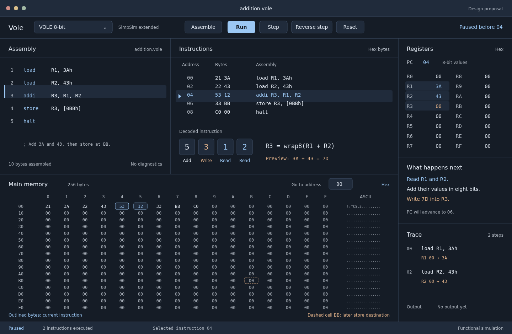

# Dark workbench design

Status: approved visual proposal. The native implementation and its measured
verification are recorded in [implementation status](../implementation-status.md).
The images below remain the original design artifacts.



The editable [SVG](vole-workbench.svg) and this rendered preview show the same
proposal. The preview uses available fallback fonts; the selected IBM Plex
families will be bundled and checked during GPUI implementation.

## Direction

Vole is a machine-instruction workbench for students and developers. Its main
job is to make one instruction's consequences obvious. Build the screen
around the relationship between source, encoded bytes and changing machine
state. The memorable element is the decoded instruction strip, where each
VOLE nibble has a visible role and points to the registers it reads or writes.

A quiet blue-slate workspace fits long study sessions. Muted blue identifies
the current instruction and reads; soft copper identifies writes. Colors
describe machine activity, with text labels and outlines carrying the same
meaning. No gradients, decorative glows or dashboard metric cards.

## Tokens

Six base tokens define the initial palette. Semantic warning/error/focus
tokens are added separately when their states are implemented.

| Token | Hex | Role |
| --- | --- | --- |
| Workspace | `#151C26` | Main background |
| Surface | `#202B3B` | Toolbar, controls, selected tabs and inset strips |
| Divider | `#405169` | Pane boundaries, data groups and control outlines |
| Ink | `#E3EAF3` | Primary text |
| Read | `#9CC8F4` | Current instruction, input operands and focus |
| Write | `#E4B48B` | Destination register/memory changes |

Muted text uses Ink at 72% opacity over Workspace or Surface. Contrast must
be measured after compositing; target 4.5:1 for ordinary text and 3:1 for
meaningful outlines/focus. Do not reduce opacity further for data values.
Surface steps communicate grouping; outlines appear where panes or editable
controls need boundaries, not around every piece of content.

Choose IBM Plex Sans for navigation, controls and explanations; IBM Plex Mono
for assembly, addresses, bytes and registers. The matched family carries the
engineering character without turning every label into terminal text. Bundle
licensed font files during implementation and include their notices.
[IBM's typeface repository](https://github.com/IBM/plex).

Type sizes: 12 for supporting information, 14 for controls/data, 16 for pane
titles and 20 for the current instruction. Code line height is 24 at default
zoom. Use tabular numeric alignment and user-adjustable editor/data zoom.

Spacing uses 4/8/12/16/24/32 logical pixels. Controls have 6px corner radii;
pane edges stay structural. Standard controls have generous click targets;
dense byte cells support keyboard navigation and an expanded edit inspector.

## Layout comparison

Option A, selected: source on the left, decoded instructions in the middle,
registers on the right, main memory below the first two panes. This makes
source-to-state comparison possible without switching tabs.

```text
+-----------------------------------------------------------------------+
| Native titlebar and document title                                    |
| Target/profile       Assemble    Run / Pause    Step    Back    Reset  |
+----------------------+----------------------------+-------------------+
| Assembly             | Instructions               | Registers         |
| Editor + diagnostics | Address / bytes / assembly | PC, flags, values |
|                      |                            +-------------------+
|                      | Decoded instruction strip  | What happens      |
+----------------------+----------------------------+-------------------+
| Main memory: addresses, bytes, current instruction | Trace / output    |
| Hex grid or virtualized memory rows               | changes and faults|
+---------------------------------------------------+-------------------+
| Execution status, instructions executed, selected address              |
+-----------------------------------------------------------------------+
```

Option B: editor with a tabbed machine inspector. It fits small windows but
hides relationships between instructions, registers and memory.

```text
+--------------------------------+------------------------------------+
| Source and instructions tabs    | Registers / memory / trace tabs    |
+--------------------------------+------------------------------------+
```

Use B as a compact adaptation, with the active instruction summary retained.
At roughly 1100 logical pixels, hide optional history and compress the source
pane. Around 850, use inspector tabs. Proposed minimum is 720x520, subject to
actual GPUI laptop/tiling checks. Choose actual breakpoints after measuring
content, especially sixteen-digit 64-bit addresses. Desktop support is the
scope; compact behavior is for small native windows, not a mobile web product.

Left-align prose, code and pane titles. Keep addresses and values in stable
columns; right-align numeric counters. Panes resize and remember their sizes.
One architecture selector shows valid targets, profile/mode and verified
capabilities. Do not offer contradictory combinations of target and width.

## Interaction details

- Selecting source, instructions or memory synchronizes the corresponding
  address. PC highlighting is separate from selection and breakpoints.
- Each Step updates all panes from the same snapshot. Read operands and
  destinations have persistent labels; an optional short change highlight
  answers the user's step and respects reduced motion.
- Before execution, explanations say what will happen. After execution,
  show observed values and writes. Never mix predicted results with history.
- Breakpoint markers belong in the source/instruction gutter. Show a text
  stop reason such as "Paused before 04" alongside the marker.
- Memory supports hex/binary, signed/unsigned integers and ASCII with explicit
  byte order for multi-byte values. A separate decode inspector explains the
  VOLE float format. Editing requires a paused machine and a validated width.
- Assemble, Run, Pause, Step, Reverse step and Reset keep the same names in
  menus, shortcuts and buttons. Show available shortcuts in menu/tooltip text.
- Empty files open with "Load an example" and "Open assembly". A diagnostic
  names the line and repair, e.g. "Line 7: R10 is not a VOLE register. Use R0
  through RF." Runtime faults show PC, offending instruction and memory access.
- Use native file dialogs, menu conventions and titlebar controls. Do not draw
  imitation macOS buttons in the shipped app.

The static proposal uses the original addition example from the plan. PC is
04 before `addi R3, R1, R2`; R1=3A, R2=43, R3=00 and memory BB=00. The decoded
strip predicts R3=7D. The trace contains only the two completed loads.

## Review against the brief

The initial idea was a conventional editor with independent rounded inspector
cards. That hides the connection between bytes and runtime changes and would
look like a generic developer dashboard. The revised proposal uses connected
panes, a complete 256-byte VOLE memory view and a prominent operand strip.
Blue and copper have read/write meanings instead of branding decoration.

The result follows the requested dark theme and keeps native macOS chrome.
Boldness is concentrated in instruction decoding. Cut decorative CPU artwork,
animated backgrounds and oversized branding; they use space that belongs to
the program. ARM/x86 use operand groups and variable-length bytes instead of
pretending every ISA has VOLE's four-nibble instruction format.

## Implementation acceptance

Check screenshots on actual GPUI builds, not only this SVG. Verify keyboard
focus, screen-reader naming where the framework permits it, selection vs PC,
contrast, 100/125/150/200% scaling, reduced motion, code/data zoom and compact
panes. Test full-length 64-bit values and long diagnostics. Native-window and
AeroSpace acceptance is specified in the implementation plan.
