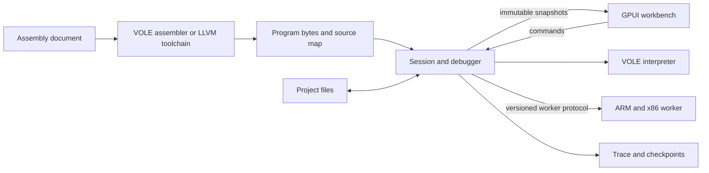

# Vole implementation plan

Status: approved and implemented on Linux. Prepared 2026-10-02. Native macOS
and Windows acceptance remains unverified. See [implementation status](implementation-status.md)
for the final architecture, evidence and remaining host checks.

This document preserves the approved proposal. Implementation settled the
backend gate by using project-owned Rust scalar interpreters instead of Unicorn.
The toolchain is part of `vole-isa-scalar`; a serialized runtime thread owns
the interpreters, so a separate CPU process/protocol is unnecessary. A headless
CLI was added for guest verification and portable-package checks. All five
requested guests remain in scope and execute machine bytes. The selected
compatible desktop dependencies are GPUI/GPUI Platform 0.3.7 and GPUI Kit 0.7.0.

## Product contract

Build a native Rust desktop app in GPUI for learning and debugging machine
instructions. The first release assembles readable instructions into bytes
and simulates their execution. Higher-level language compilation comes later,
as confirmed by the user.

The first release must cover VOLE 8-bit, ARM/AArch32 32-bit, ARM64/AArch64
64-bit, x86/IA-32 32-bit, and x86-64/x64 64-bit. VOLE ships as the first usable
development milestone; the other targets remain part of the release scope.
RISC/CISC labels describe families in the selector. They are not additional
invented languages. The app runs each guest independently of the host CPU.

The main view keeps source, executable bytes, readable instructions, registers,
main memory and execution history synchronized. Run, Pause, Step, Reset and
breakpoints are required. Reverse Step is required for VOLE; real-ISA reversal
ships only after complete state restoration is proven.

Initial ARM/x86 support targets documented scalar teaching programs. Publish
an instruction and environment support matrix. Full ISA coverage, SIMD,
privileged instructions, OS boot, arbitrary application binaries, cycle timing
and whole-program decompilation are outside the first release. Extra backend
capabilities do not automatically count as tested product support.

## Research-backed choices

| Area | Proposal | What must be proven |
| --- | --- | --- |
| Desktop | GPUI, with GPUI Kit evaluated for editor/input/split primitives | Compatible pinned dependencies; native window on all three OSes |
| VOLE | Project-owned Rust interpreter, assembler and decoder | All supplied opcodes, overflow, extensions and compatibility conventions |
| ARM/x86 execution | Unicorn behind a headless worker boundary | License/distribution decision, host builds, hooks, faults and stepping |
| Real-ISA assembly | Pinned LLVM MC + LLD toolchain | Labels, relocations, source mapping and distributable toolchain |
| Real-ISA decoding | Stable Capstone engine/binding pair | Mode, operands, register aliases and decode errors |
| Explanations | Deterministic rules plus observed state changes | Explain only known semantics; never invent source code |
| Files | Versioned project format plus source and raw-byte import/export | Round-trip state, profile, memory layout and migration checks |

See [simulator research](research/simulation.md) and
[GPUI platform research](research/gpui-platforms.md) for primary sources.
No dependency versions in these proposals have been compiled here. GPUI's
published crate and current platform-split source differ; choose an internally
compatible dependency set in the first milestone and commit the lockfile.

Unicorn's licensing needs resolution before adopting the backend. Check exact
versions and intended distribution against GPUI and other dependencies. Keep
the engine replaceable. A worker process helps isolation and cancellation;
it is not an automatic licensing solution. If Unicorn cannot be adopted,
record a revised effort/scope plan for project-owned scalar interpreters
before continuing real-ISA implementation. Do not drop the requested targets
silently. No license is assigned as part of this planning initialization.

## Proposed workspace

Create this structure after approval, adding crates when their milestone starts
so the repository does not accumulate empty implementations.

```text
Cargo.toml                  workspace, shared dependency pins and lints
Cargo.lock                  reproducible application dependency graph
rust-toolchain.toml         tested toolchain, rustfmt and clippy
crates/
  vole-core/                ISA descriptors, memory, snapshots, trace protocol
  vole-isa-vole/            VOLE assembly, decoding and execution
  vole-toolchain/           LLVM processes, linking, image/source-map loading
  vole-runtime/             session commands, debugger, backend adapters
  vole-cpu-worker/          isolated real-ISA engine and worker protocol
  vole-project/             project format, import/export and migrations
  vole-app/                 GPUI application, views, commands and platform setup
examples/                   original teaching programs per target
tests/fixtures/             bytes, expected traces and compatibility fixtures
packaging/                  platform manifests, icons and bundle resources
.github/workflows/          per-OS build/test and release packaging
docs/                       research, design, plan and later user documentation
```

Core and VOLE crates must build and test without GPUI, LLVM or a native CPU
backend. Avoid importing Zed's application/editor wholesale; licensing and
coupling differ from GPUI itself.



## Machine and debugger rules

- Target descriptors own register widths, aliases, byte order, decode mode,
  alignment rules and memory layout. Guest addresses are `u64`; no host pointer
  casts. Signed/unsigned/hex/binary display choices never change machine state.
- One runtime owner serializes commands. UI snapshots carry session, source
  revision and sequence IDs. Discard stale assembly results and worker updates.
- State transitions distinguish editing, assembling, ready, running, paused,
  halted and faulted. A failed assembly retains source/diagnostics and disables
  running stale bytes until the user explicitly selects the previous image.
- Pause before machine edits. Source edits mark the executable stale; Assemble
  creates a new image and clears execution history. Reset restores the loaded
  initial machine image, registers and device state while retaining breakpoints.
- Run has an instruction budget and publishes bounded snapshots. Pause must
  interrupt long loops; keep expensive emulation and assembly off the UI thread.
  Repeated x86 string instructions require separate cancellation testing.
- Breakpoints stop before execution. Resume can pass the current breakpoint
  once without losing it. Watchpoints report accesses and instruction address.
  Memory edits invalidate affected disassembly/source associations and the
  backend's translated-code cache.
- VOLE uses a fixed byte array. Larger guests have bounded sparse code/data/
  stack regions with permissions and an allocation ceiling. Inspect unmapped
  addresses without allocating them. Virtualize memory and trace views.
- History budgets cover instruction records and bytes, including overlapping
  writes, aliased registers, output and device state. Reverse restoration also
  invalidates code caches. Backend CPU contexts alone are insufficient.
- The teaching I/O adapter has deterministic output/exit conventions for each
  target. Unsupported OS syscalls and privileged instructions produce useful
  faults. Simulated guest instructions do not become host instruction calls.

## VOLE compatibility specification

The supplied table and SimpSim author's help define these encodings. R, S and T
are register nibbles, XY is an 8-bit value/address, and X is a rotation count.

| Encoding | Assembly | Effect |
| --- | --- | --- |
| `1RXY` | `load R, [XY]` | Read memory into R |
| `2RXY` | `load R, XY` | Load immediate |
| `3RXY` | `store R, [XY]` | Write R to memory |
| `40RS` | `move S, R` | Copy R into S; preserve this operand order |
| `5RST` | `addi R, S, T` | Add modulo 256 |
| `6RST` | `addf R, S, T` | Add in the selected teaching float format |
| `7RST` | `or R, S, T` | Bitwise OR |
| `8RST` | `and R, S, T` | Bitwise AND |
| `9RST` | `xor R, S, T` | Bitwise XOR |
| `AR0X` | `ror R, X` | Rotate right in eight bits |
| `BRXY` | `jmpEQ R=R0, XY` | Branch if R equals R0 |
| `B0XY` | `jmp XY` | Always branch through the equality alias |
| `C000` | `halt` | Stop execution |
| `D0RS` | `load R, [S]` | Read memory addressed by register S |
| `E0RS` | `store R, [S]` | Write through register S |
| `FRXY` | `jmpLE R<=R0, XY` | Branch on the profile's less-or-equal comparison |

The initial profile is named `simpsim-extended-v1`. Proposals that the screenshot
alone cannot prove must be finalized before calling it compatible:

- Sixteen 8-bit registers and 256 byte cells; fetch first byte then second byte.
  Proposed PC behavior wraps modulo 256, including a fetch beginning at FF.
  Permit byte-addressed branch targets; label odd-address execution explicitly.
- Strict reserved bits on move/rotate/indirect instructions and strict C000 halt.
  Opcode zero is a fault. Record old PC and the post-instruction PC in traces.
- Proposed F comparison uses two's-complement signed values. Verify against
  authoritative course/SimpSim behavior; if unresolved, label it as this app's
  convention and do not claim exact F compatibility.
- Verify the teaching float representation against an authoritative reference.
  The candidate is sign + three-bit excess-4 exponent + four-bit fractional
  mantissa. Document normalization, rounding, zero and overflow with fixtures.
  Do not use IEEE float8 or host floating point as a substitute without proving
  the required byte results. Format details remain an open research item.
- RF writes produce simulated text in the SimpSim profile, including output
  from load/arithmetic. Define control bytes and reversible output precisely.
  A plain VOLE profile can instead use explicit memory-mapped output.
- Accept case-insensitive mnemonics, labels, semicolon comments, decimal,
  suffix-h hex, `0x` hex, `org`, and `db` bytes/strings. Define negative-byte
  literals, string encoding, origin overlap and capacity diagnostics.

Authoritative sources: [instruction help](https://www.anne-gert.nl/projects/simpsim/images/instructions.gif),
[syntax help](https://www.anne-gert.nl/projects/simpsim/images/syntax.gif),
[output example](https://www.anne-gert.nl/projects/simpsim/examples/outtest.asm).

Use an original five-instruction acceptance program:

```asm
load R1, 3Ah
load R2, 43h
addi R3, R1, R2
store R3, [0BBh]
halt
```

It must assemble at origin 00 to `21 3A 22 43 53 12 33 BB C0 00`, produce R3=7D,
write memory BB=7D and halt. The visual proposal shows the state just before
the third instruction, with its result shown as a preview.

## Milestones and acceptance

| Milestone | Work | Exit criteria |
| --- | --- | --- |
| 0. Feasibility | Pin GPUI/Kit and Rust; native window spike on each OS; settle backend/license direction; finalize VOLE ambiguities | Real normal window on macOS, Windows and Linux; agreed engine/distribution decision; documented VOLE policies |
| 1. VOLE engine | Decoder, assembler, interpreter, main memory, RF output, trace and reverse step | All opcodes including D/E/F tested; byte/trace fixtures; original acceptance program; invalid inputs and boundary cases |
| 2. Workbench | Dark GPUI layout, input editor, disassembly/explanations, registers, memory and run controls | Complete assemble/step/run/pause/reset/save workflow; breakpoints; accessible keyboard navigation; persistent pane sizes |
| 3. ARM64 | CPU worker, toolchain, loader, Capstone, registers and teaching I/O | Load/store/arithmetic/branch/call/stack examples; accurate PC, W/X aliases and flags; tested faults; responsive Pause |
| 4. ARM32 | A32 target, register/flag model and toolchain mode | Same workflow and fixtures; alignment and mode errors; explicit Thumb unsupported state |
| 5. x86 and x64 | Both modes, register aliases, flags, variable-length decode, stack and teaching I/O | Per-mode arithmetic/memory/branch/call fixtures; alias-write rules; instruction-length handling; repeated-instruction cancellation |
| 6. Release | Versioned files, original examples/help, platform packaging and full regression matrix | Every required guest works on every shipping host; install/launch/save/reopen tests; native window evidence; bundled toolchain/dependency notices |

Milestones 3-5 use the engine approved at milestone 0. Each target declares
accepted syntax, verified instructions, memory layout, endianness and exit/I/O
ABI. Architectural support and plain-English explanation support have separate
coverage tables. The app must say when execution is supported but an explanation
is unavailable.

During milestone 0 also prove LLVM linking/source maps for one program per
real ISA. If redistributable LLVM tooling or backend licensing fails, surface
that result before promising a self-contained multi-ISA release. Do not save
the feasibility test until the final packaging milestone.

## Design and native window acceptance

Use the [dark workbench proposal](design/workbench.md) and its
[static visual](design/vole-workbench.svg). GPUI renders the actual interface;
the SVG is an approval artifact, not an implemented UI.

macOS must get a standard resizable main window, real traffic lights and native
fullscreen, a normal Dock app, application menus, document commands, correct
Cmd shortcuts, Retina scaling and close/reopen behavior. Test accessibility
role/subrole and fullscreen controls. Test a fresh opening in AeroSpace and
confirm neighboring tiled windows actually make room; appearance in the window
list alone does not pass. Do not modify the user's AeroSpace configuration as
a substitute for app behavior. A specific local compatibility fix, if needed,
must be reported separately.

Windows acceptance covers native minimize/maximize/close, resizing, keyboard
input and DPI scaling. Linux acceptance covers both Wayland and X11, window
manager resizing, clipboard and supported Vulkan drivers. Set minimum size
only after testing tiled and laptop layouts. Collapse optional panes before
forcing a window that cannot fit on a MacBook screen.

These checks cannot run in this Linux planning environment on behalf of a
MacBook or Windows machine. Record them as unverified until tested on the
actual builds and hosts. CI compilation does not replace native runtime tests.

## Verification and delivery

Test machine behavior through public assembler/runtime operations. Include
byte-to-instruction round trips, extension semantics, branch outcomes,
wrapping arithmetic, float fixtures, self-modification, reset, reversal,
breakpoint resume, faults, stale assembly results and project round trips.
For larger guests, exercise sparse mappings and address overflow. Use
independent expected traces or trusted-engine comparison for real-ISA fixtures.

After workspace creation, require formatting, Clippy, workspace tests and
per-platform build checks with compatible locked dependencies. Run focused
native interaction checks for editing, scrolling, shortcuts, Pause and file
dialogs. Measure responsiveness under long loops and large memory views.

First shipping hosts: Apple Silicon and Intel macOS builds, Windows x64,
Linux x64. Assess Linux ARM64 as an additional build; Windows ARM64 is a later
host extension. Guest ARM64 support does not depend on a Windows ARM64 build.
Prove OS baselines and hardware/driver requirements before publishing support
claims. Package macOS .app/DMG, Windows installer or portable bundle, and
Linux archives/packages after build spikes identify usable tooling. Signing
and notarization require owner credentials at release time.

This initialization deliberately adds planning documents, the static design,
ignore rules and editor defaults only. Git was already initialized and is
preserved. No application, Cargo manifests, dependencies, remote or commits
are created by the planning stage. Approval starts milestone 0.
