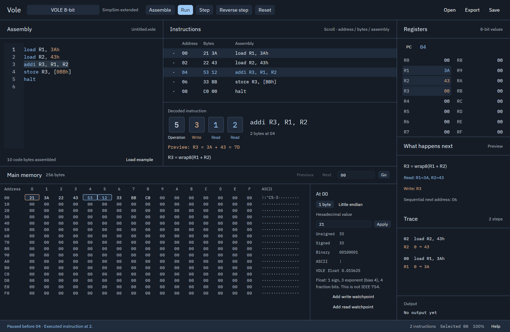

# Verification evidence

This directory records the native Linux implementation checks performed on
2026-10-02. The screenshots come from GPUI windows. The original SVG in
`docs/design` remains the approved design proposal.

The screen matches the proposal's machine state: PC 04, R1=3A, R2=43, R3=00,
memory BB=00, two completed loads, and the predicted sum 7D. All five assembled
instructions and all 256 VOLE memory cells are visible. The approved blue/slate
palette, IBM Plex fonts and copper write highlights are used throughout.

Additional captures show the [1280x800 laptop layout](screenshots/vole-laptop.png),
[720x520 compact tabs](screenshots/vole-compact.png),
[dark close prompt](screenshots/dark-close-prompt.png), and a
[restored 65% vertical pane split](screenshots/restored-layout.png).

| Guest | Wide native layout | Compact native layout | Recorded proof |
| --- | --- | --- | --- |
| VOLE | [1440x940](screenshots/vole-wide.png) | [720x520](screenshots/vole-compact.png) | [Window and keyboard receipt](packaged-vole-window.json) |
| ARM32 | [1440x894](screenshots/arm32-wide.png) | [720x520](screenshots/arm32-compact.png) | [Observed layout states](additional-guest-layouts.json) |
| ARM64 | [1440x940](screenshots/arm64-wide.png) | [720x520](screenshots/arm64-compact.png) | [Window and keyboard receipt](packaged-arm64-window.json) |
| x86 | [1440x894](screenshots/x86-wide.png) | [720x520](screenshots/x86-compact.png) | [Observed layout states](additional-guest-layouts.json) |
| x64 | [1440x940](screenshots/x64-wide.png) | [720x520](screenshots/x64-compact.png) | [Window and keyboard receipt](packaged-x64-window.json) |

Receipts identify the binary used for each check. The final changes after the
VOLE/ARM64 matrix were instruction-description wording and native title-update
caching; x64 and x86 were checked again on that binary. A final window-local
Quit handler then fixed Ctrl+Q with editor focus; native Cancel and Discard
were [verified on the updated application](native-quit.json), with the
[prompt](screenshots/quit-prompt.png) and
[preserved source after Cancel](screenshots/quit-cancel.png) captured. The local archive is a
development build, with all five [packaged smoke checks](package-verification.json)
and [raw-byte round trips](engine-roundtrip-verification.json) retained here.
The [final package receipt](final-package.json) records the refreshed archive
and application hashes, including the verified Quit fix.

## Machine and persistence checks

The final `cargo test --workspace --locked` run passes **74 tests**.
[Exact test output](workspace-tests.txt) covers all supplied VOLE opcodes,
floating-point conventions, each real ISA's independently specified bytes,
aliases, flags, branch/call/stack behavior, teaching output, atomic faults,
reversal, self-modification, breakpoint resume, watchpoints, stale source,
saved state and bounded inputs. Old project layouts receive the new vertical
split default. Invalid saves preserve existing documents.

`cargo clippy --workspace --all-targets --locked -- -D warnings` and
`cargo fmt --all --check` pass. [Clippy output](clippy.txt) is retained.
The packaged CLI independently checks the five addition programs and their
source-to-byte-to-runtime round trips. Raw byte execution is checked with
LLVM discovery explicitly disabled.

## Native interaction and visual checks

[Observed native interactions](native-interactions.json) include Step,
Reverse, Run/Pause, Reset, F9 breakpoints, editor typing, Ctrl+Enter assembly,
invalid-register diagnostics, register/memory edits, watchpoint toggling,
native GTK Open/Save using a path with spaces, saved execution-state restoration
and Close cancellation. Editing clears history. A saved vertical fraction of
0.65 restored the visible divider and saved again as 0.6499999.

The Linux environment uses Xvfb/Openbox, an X11 compositor and Mesa llvmpipe
Vulkan. Native file dialogs run through xdg-desktop-portal/GTK in a private
D-Bus desktop session. Wayland rendering was also observed under Weston.
Physical GPU behavior and native macOS/Windows acceptance remain separate.

The visual loop repaired an upstream X11 blank-frame issue, retained pane
widths when shrinking, truncated dialog text, the editor's Ctrl+Enter conflict,
overlapping long x64 instruction bytes, register ordering and stale preview
labels. Compact Instructions, Memory, Registers and Trace views were inspected
with full-width 64-bit addresses. The final native automation records window
properties, binary hashes and five sizes in `dist/native-evidence`.

The final [packaged VOLE window receipt](packaged-vole-window.json) polls the
displayed instruction counter after each real keyboard event. It confirms
2→3→4→5 instructions, then reverse to 4. The
[halted frame](screenshots/vole-halted.png) shows PC 0A, R3=7D and memory BB=7D;
the [reverse frame](screenshots/vole-reversed.png) shows PC 08 and four steps.
This avoids accepting a nonblank but stale compositor frame as input evidence.
The [CI-style private Linux launch](ci-style-linux-window.json) also passes
the default non-demo 0→1→2→3→2 sequence and cleans up its owned processes.

## Standards review

The independent review used initial commit `f7b98c2` as the baseline and the
staged implementation as the diff. It found no hard documented-standard
breaches. Two nonblocking maintenance observations remain: register alias
tables are shared conceptually between inspection and execution, and teaching
memory-map constants appear in the loader, toolchain and import paths.
Their public boundary fixtures currently agree. Consolidating those definitions
is future maintenance work.

## Spec review

Two actionable findings were fixed. The runtime now advances its revision
when publishing Assembling, disabling execution of the previous image. Project
files now save and restore the vertical source/memory split as well as the
horizontal pane sizes. Both have regression coverage; native reopen also
confirmed the vertical split.

Two acceptance limits remain open: native macOS/Windows/AeroSpace checks and
the source-built LLVM 18 release pipeline have not run here. The local portable
development package uses verified LLVM 14.0.6. Prepared CI and platform metadata
do not count as execution evidence. See
[host acceptance](../native-verification.md) before claiming a release on those
hosts.

Review result: Standards has zero hard breaches and two maintenance observations;
Spec's two code findings are closed, with two external acceptance limits open.
